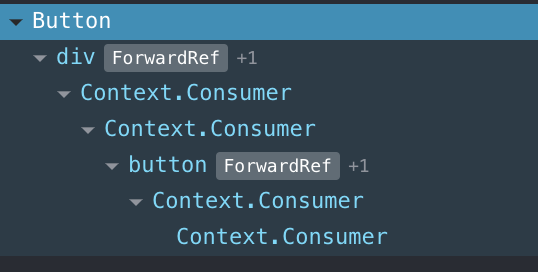

# Стилизация компонетов

TODO: 
- попробовать анимации

## Запуск

```shell script
npm start
```

## Css modules
https://create-react-app.dev/docs/adding-a-css-modules-stylesheet/  

## Плюсы
- ...

## Минусы
- ...

## StyledComponent
https://styled-components.com/  
https://habr.com/ru/post/417707/  

## Плюсы
- ...

## Минусы
- программа компилируется, даже если в стилях явная ошибка
- программа может упасть из-за стилей
- нечитабельные стили - исправляется
    - добавлением `babel-plugin-macros.config.js`
    - и `import 'styled-components/macro'`

## Emotion

## Плюсы
- ...

## Минусы
- добавились вложенные компоненты

- нечитабельные стили
